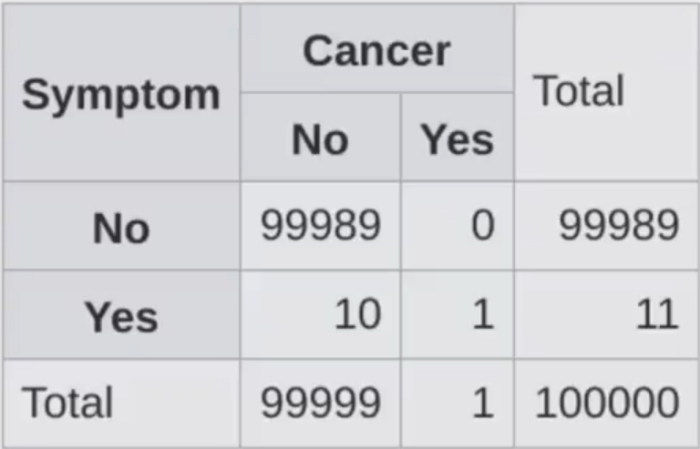
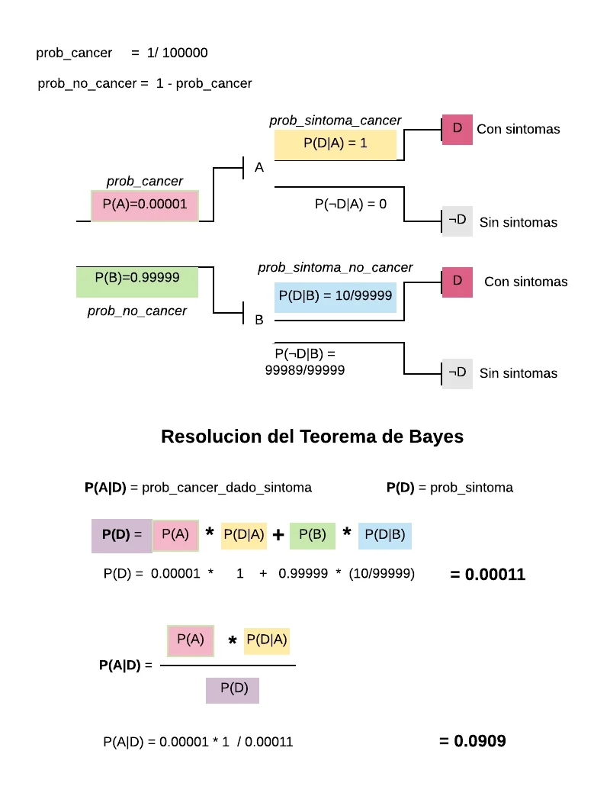

# Introducción a la programación probabilística

Created By: Robert H C
Last Edited: Sep 29, 2020 11:07 PM
Tags: Data Science, Platzi

La programación probabilística utiliza probabilidades y modelos probabilísticos para ejecutar cómputos, Se utiliza en campos como investigación científica, inteligencia artificial, medicina, etc.

Existen librerías para ejecutar este computo, como Pyro de Uber.

- Las probabilidades cuando de un subconjunto (&) son menos probables

    

    Ejm: Ser musico y consumir drogras es menos probable

# Probabilidad condicional

Cuando tenemos probabilidades condicionales, tenemos que conciderar el evento anterior.

```python
P(A and B) = P(A) . P(B|A)
P(B) = P(A) . P(B|A) + P(~A) . P(B|~A)
```

# Teorema de Bayes

La probabilidad no es directa a una caso, se necesita pensar en las demás exploraciones. Cual es la probabilidad inicial, una vez aplicada las probabilidades directa a una población cual es el resultado posterior. 

```python
          P(B|A) . P(A)
P(A|B) = ---------------
               P(B)

            P(H and E)
P(H|E) = ---------------
               P(E)

```


H = hipótesis

E = Evento

P(H) = Prior = hipótesis antes de la evidencia

P(H|E) = Posterior = Ya teniendo evidencia como actualizamos cierta creencia.

P(E|H) = Likelihood = Certeza de que esta situación es correcta.

## Analisis de síntomas





# Aplicaciones del Teorema de Bayes

El Teorema de Bayes es uno de los mecanismos matemáticos más importantes en la actualidad. A grandes rasgos, nos permite medir nuestra certidumbre con respecto a un suceso tomando en cuenta nuestro conocimiento previo y la evidencia que tenemos a nuestra disposición. El Teorema de Bayes permea en tu vida diaria, desde descubrimientos científicos hasta coches autónomos, el Teorema de Bayes es el motor conceptual que alimenta mucho de nuestro mundo moderno.

## Turing y el código enigma de los Nazis

Casi todos sabemos que Alan Turing es uno de los padres del cómputo moderno; pocos saben que fue gracias a él que los aliados pudieron tener una ventaja decisiva cuando Turing logró descifrar el código enigma que encriptaba todas las comunicaciones nazis; pero aún menos saben que para romper este código utilizó el Teorema de Bayes.Lo que hizo Turing fue aplicar el Teorema para descifrar un segmento de un mensaje, calcular las probabilidades iniciales y actualizar las probabilidadesde que el mensaje era correcto cuando nueva evidencia (pistas) era presentada.

## Finanzas

Una de las decisiones más difíciles cuando estás manejando un portafolio de inversión es determinar si un instrumento financiero (acciones, valores, bonos, etc.) se va a apreciar en el futuro y por cuánto, o si, por el contrario se debe vender el instrumento. Los *portafolios managers* más exitosos utilizan el Teorema de Bayes para analizar sus portafolios.En pocas palabras, puedes determinar las probabilidades iniciales basándote en el rendimiento previo de tu portafolio o en el rendimiento de toda la bolsa yluego añadir evidencia (estados financieros, proyecciones del mercado, etc.) para tener una mayor confianza en las decisiones de venta o compra.

## Derecho

El Derecho es uno de los campos más fértiles para aplicar pensamiento bayesiano. Cuando un abogado quiere defender a su cliente, puede comenzar a evaluar una probabilidad de ganar (basada en su experiencia previa, o en estadísticas sobre el número de juicios y condenados con respecto del tema legal que competa) y actualiza su probabilidad conforme vayan sucediendo los eventos del proceso jurisdiccional.Cada nueva notificación, cada prueba y evidencia que encuentre, etc. sirve para actualizar la confianza del abogado.

## Inteligencia artificial

El Teorema de Bayes es central en el desarrollo de sistemas modernos de inteligencia artificial. Cuando un coche autónomo se encuentra navegando en las calles, tiene que identificar todos los objetos que se encuentran en su “campo de visión” y determinar cuál es la probabilidad de tener una colisión. Esta probabilidad se actualiza con cada movimiento de cada objeto y con el propio movimiento del vehículo autónomo. Esta constante actualización de probabilidades es lo que permite que los vehículos autónomos tomen decisionesacertadas que eviten accidentes.

En esta rama existen muchos ejemplos como para cubrirlos todos, pero quiero por lo menos mencionar algunos casos de uso: filtros de spam, reconocimiento de voz, motores de búsqueda, análisis de riesgo crediticio, ofertas automáticas, y un largo etcétera.

Me gustaría compartir una cita del famoso economista John Maynard Keynes que resume perfectamente el tipo de pensamiento que quiero que desarrolles: *“Cuando los hechos cambian, yo cambio mi opinión. ¿Qué hace usted, señor?”*